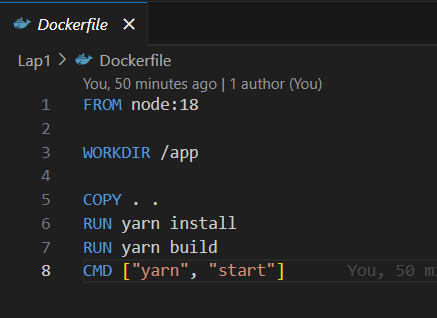
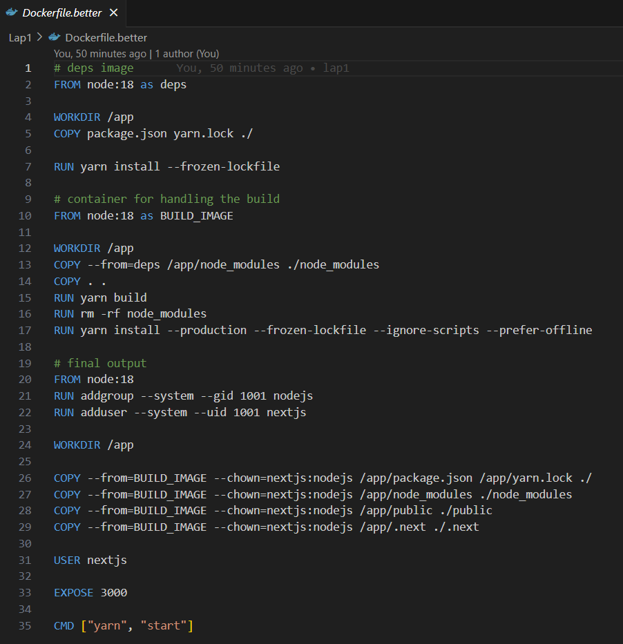

# Лабораторная работа №1

## Цели работы

Написать два Dockerfile – плохой и хороший.

## Ход работы

В этом упражении мы написали 2 Dockerfile чтобы сравнить. Оба Dockerfile имеет функция для развертывания проект Next.js на localhost. 
Тепер обсуждим что написали в 2 Dockerfile

## В Плохой Dockerfile



Обяснить код:

FROM node:18: указывает базовый образ Node.js версии 18. Этот образ доступен в официальном репозитории Node.js Docker Hub.

WORKDIR /app: устанавливает рабочий каталог внутри контейнера в /app. Это каталог, в котором будут выполняться последующие команды.

КОПИРОВАТЬ. .: копирует все файлы и каталоги из локального контекста (каталог, в котором находится файл Dockerfile) в каталог /app в контейнере. Сюда входит код вашего приложения, package.json и любые другие файлы.

RUN Yarn install: устанавливает зависимости приложения Node.js с помощью менеджера пакетов Yarn. Эта команда основана на файлах package.json и Yarn.lock, скопированных на предыдущем шаге.

RUN Yarn build: строит приложение. Предполагается, что в разделе сценариев файла package.json определен сценарий сборки, обычно это что-то вроде «build»: «some-build-command».

CMD ["yarn", "start"]: устанавливает команду по умолчанию, запускаемую при запуске контейнера. Это запустит приложение с помощью команды запуска пряжи. Если при запуске контейнера не указана команда, эта команда будет выполнена по умолчанию.

## В Хороший Dockerfile



Обяснить код:

Этот Dockerfile представляет собой многоэтапную сборку. Мы использовали несколько этапов для оптимизации размера получаемого образа Docker и отделения зависимостей разработки от рабочего образа.

1. **изображение глубины:**

   ```Dockerfile
   FROM node:18 as deps
   WORKDIR /app
   COPY package.json yarn.lock ./

   RUN yarn install --frozen-lockfile
   ```

   - Этот этап называется «депс».
   - Устанавливает рабочий каталог `/app`.
     — Копирует в рабочий каталог только package.json и Yarn.lock.
     — Устанавливает зависимости с помощью Yarn install с флагом --frozen-lockfile, что обеспечивает воспроизводимость за счет использования точных версий, указанных в файле блокировки.

2. **BUILD_IMAGE:**

   ```Dockerfile
   FROM node:18 as BUILD_IMAGE
   
   WORKDIR /app
   COPY --from=deps /app/node_modules ./node_modules
   COPY . .
   RUN yarn build
   RUN rm -rf node_modules
   RUN yarn install --production --frozen-lockfile --ignore-scripts --prefer-offline
   ```

   - Этот этап называется BUILD_IMAGE.
   - Устанавливает рабочий каталог `/app`.
     — Копирует каталог node_modules со стадии deps.
   - Копирует весь исходный код приложения.
   - Собирает приложение с помощью Yarn build.
     — Удаляет зависимости разработки («node_modules»).
     — Устанавливает только производственные зависимости с дополнительными флагами для оптимизации (`--production`, `--ignore-scripts`, `--prefer-offline`).

3. **Окончательный результат:**

   ```Dockerfile
   FROM node:18 
   RUN addgroup --system --gid 1001 nodejs
   RUN adduser --system --uid 1001 nextjs
   
   WORKDIR /app
   
   COPY --from=BUILD_IMAGE --chown=nextjs:nodejs /app/package.json /app/yarn.lock ./
   COPY --from=BUILD_IMAGE --chown=nextjs:nodejs /app/node_modules ./node_modules
   COPY --from=BUILD_IMAGE --chown=nextjs:nodejs /app/public ./public
   COPY --from=BUILD_IMAGE --chown=nextjs:nodejs /app/.next ./.next
   
   USER nextjs
   
   EXPOSE 3000
   
   CMD ["yarn", "start"]
   ```

   - Использует окончательное изображение `node:18`.
     — Создает системную группу и пользователя («nodejs» и «nextjs») с указанными UID и GID.
   - Устанавливает рабочий каталог `/app`.
   - Копирует файлы со стадии `BUILD_IMAGE`, настраивая владельца с помощью `chown`.
   - Переключается на пользователя nextjs.
   - Открывает порт 3000.
   - Определяет команду по умолчанию для запуска приложения: `yarn start`.

---

Перечислите тонкости Dockerfile.better

1. Давайте развернем проект NEXT.js, но, как показано на рисунке, размер файла образа Dockerfile.better составляет всего половину файла образа Dockerfile, поскольку Dockerfile.better разделен на множество промежуточных шагов. Окончательный образ, вероятно, будет меньше, поскольку он включает только необходимые файлы и зависимости, скопированные с промежуточных шагов. Это может привести к более быстрому и эффективному получению и развертыванию изображений.
   
Размер изображения dockerfile :


3. Уменьшенная поверхность атаки:
Окончательный образ содержит только встроенные артефакты и зависимости времени выполнения, что сводит к минимуму поверхность атаки. Промежуточные шаги, используемые для создания зависимостей и приложений, исключаются, что снижает риск включения ненужных инструментов или библиотек в окончательный образ.
4. Быстрая сборка:
Разделив этапы сборки, вы можете воспользоваться преимуществами кэширования классов. Если зависимости и исходный код не меняются, Docker может повторно использовать кешированные классы с предыдущих этапов, ускоряя процесс сборки.

---
Для запуска системы необходимо:

1. Клонируйте код на свое устройство.

2. откройте папку (например, Visual Studio) и выполните команду:
   
docker build . -t nextjs-docker 

3. Дождитесь завершения сборки Docker, затем выполните команду:
   
docker run -e PORT=3000 nextjs-docker

Результаты запуска проекта на localhost:


