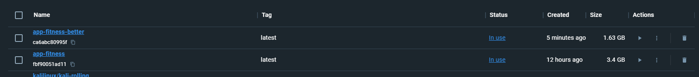
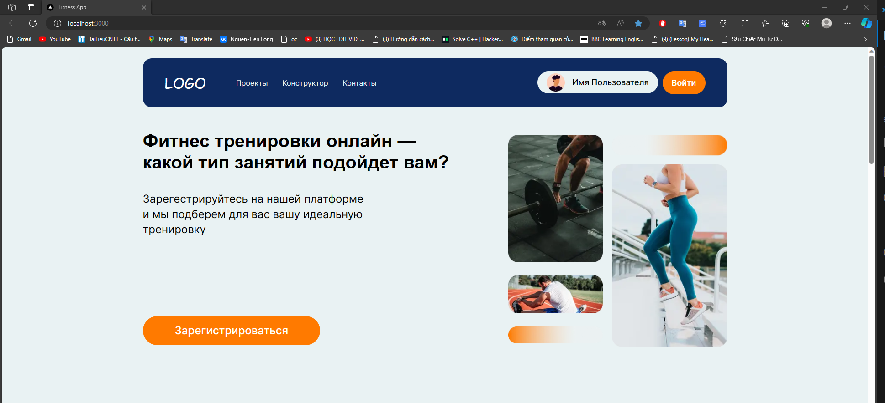

Предоставленный вами Dockerfile.better имеет многоэтапную сборку, которая обычно считается лучшей практикой для оптимизации образов Docker. Многоэтапные сборки помогают уменьшить размер окончательного образа за счет использования промежуточных образов для построения зависимостей и последующего копирования в итоговый образ только необходимых артефактов.

Вот некоторые преимущества первого Dockerfile (многоэтапная сборка):

1. Меньший окончательный размер изображения:
      - Окончательный образ, вероятно, будет меньше, поскольку он включает только необходимые файлы и зависимости, скопированные с промежуточных шагов. Это может привести к более быстрому и эффективному получению и развертыванию изображений.

2. Уменьшенная поверхность атаки:
      - Окончательный образ содержит только встроенные артефакты и зависимости времени выполнения, что сводит к минимуму поверхность атаки. Промежуточные шаги, используемые для построения зависимостей и приложения, отбрасываются, что снижает риск включения ненужных инструментов или библиотек в окончательный образ.

3. Быстрая сборка:
      - Разделив этапы сборки, вы можете воспользоваться преимуществами кэширования слоев. Если зависимости и исходный код не изменились, Docker может повторно использовать кэшированные слои с предыдущих этапов, что ускоряет процесс сборки.

4. Четкое разделение интересов:
      - Каждый этап Dockerfile несет определенную ответственность (например, построение зависимостей, сборка приложения, создание окончательного образа среды выполнения). Такое четкое разделение задач может сделать Dockerfile более удобным и понятным.

С другой стороны, Dockerfile — это более простая одноэтапная сборка. Хотя это проще, в результате может получиться более крупный окончательный образ, а также включить в окончательный образ зависимости разработки, которые могут не потребоваться для производственной среды.

Таким образом, Dockerfile.better с многоэтапной сборкой обычно предпочтительнее для промышленного использования из-за его преимуществ с точки зрения размера образа, безопасности и эффективности сборки. Dockerfile может больше подойти для разработки или в ситуациях, когда размер образа не имеет решающего значения.

Размер изображения dockerfile :

Результат выпольнил:

