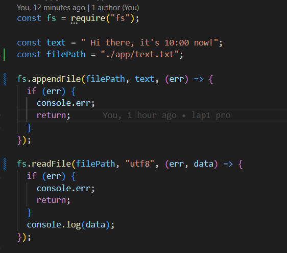
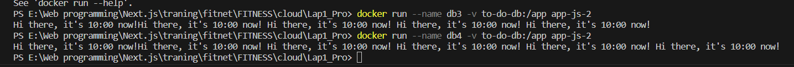

# Лабораторная работа №1PRO

## Цели работы

Написать приложение в запущенном контейнере должно записывать изменения в базу данных. При остановке контейнера информация не должна исчезать.
Файл должен иметь название, отличное от Dockerfile.

## Ход работы

В этом упражении мы написали простой приложение.js чтобы добавить текст в text.txt file

Для запуска программы на Docker мы написали Long.Dockerfile.

Это очень простой Dockerfile с задачей создания среды для запуска javascript-программ.Особенным моментом здесь является то, что имя файла — Long.Dockerfile немного отличается от обычного формата, поэтому Docker можно собрать.Затем нам нужно добавить флаг -f или --file + Dockerfile_Custom:

docker build -f Long.Dockerfile -t app-js .

Как обычно, каждый раз, когда выполняется образ запуска Docker, Docker создает совершенно новый контейнер. Чтобы иметь возможность сохранять изменения между инициализациями контейнера, необходимо использовать том Docker (это том Docker). Каталог внутри Docker поддерживает хранение изменения, а также обмен данными с другими контейнерами

Чтобы использовать тома Docker, нам сначала нужно инициализировать том с помощью команды:

docker volume create to-do-db

(to-do-db: это имя тома, которое можно изменить по вашему желанию)

Затем запустите docker, связанный с томом, с помощью команды:

docker run -v to-do-db:/app app.js

вы можете видеть изменения данных каждый раз при запуске докера в журнале докера:

