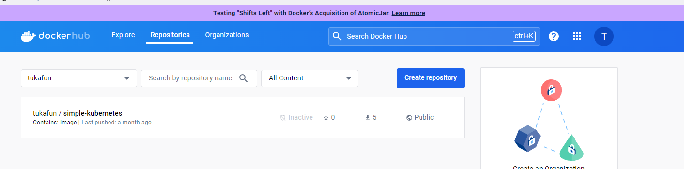
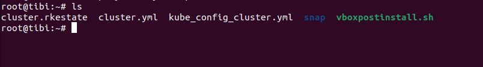

# Лабораторная работа №2 "Работа с Kubernetes"

## Выполнили:

Буй Ань Туан К34211, Нгуен Тиен Лонг К34201

## Цель работы:

Поднять kubernetes кластер локально, в нём развернуть свой сервис.

## Задачи:

Использовать 2-3 ресурса kubernetes, поднять кластер RKE.

## Ход работы:

Для поднятия локального Kubernetes кластера и развертывания своего сервиса были использованы RKE (K3S) и kubectl.

Для работы нам потребуются:

- Docker Engine – для создания образа Docker и контейнеров
- kuberctl – для запуска команд для кластеров Kubernetes
- RKE - для запуска Kubernetes на локальной машине

Для успешной работы необходимо, чтобы в системе были установлены docker, kubectl и RKE.

Мы выбрали RKE из-за Rancher Kubernetes Engine (RKE), невероятно простого и молниеносного дистрибутива Kubernetes, который полностью работает в контейнерах.

### Создание образа

Напишем статический сайт, который будем разворачивать. Внутри директории проекта создадим следующий Dockerfile:

```
FROM python:3.9

WORKDIR /code

COPY ./requirements.txt /code/requirements.txt

RUN pip install --no-cache-dir --upgrade -r /code/requirements.txt

COPY ./4docker /code/app

ENV PORT=5000

EXPOSE $PORT

CMD [ "python", "./app/app.py" ]

```

И requirements.txt

```
Jinja2==3.1.2
MarkupSafe==2.1.3
Werkzeug==3.0.1
blinker==1.7.0
click==8.1.7
colorama==0.4.6
flask==3.0.0
itsdangerous==2.1.2
```

### Переходим к сохранению вновь созданного образа в Docker Hub.

Команду мы используем «docker push tukafun/simple-kubernetes:latest». затем тестируем на Docker Hub и получаем результаты, как показано на картинке.

<p align="center"></p>

### Cai dat RKE

Chúng tôi cài đặ RKE lên máy ảo Ubuntu. Sau khi cài đặt Helm và kubectl thì chúng tôi tiến hành tải file RKE bằng lệnh "curl -LO https://github.com/rancher/rke/releases/download/v1.3.14/rke_linux-amd64".
Tiếp đến chúng tôi tiến hành các bước cài đặt như: sao chép RKE vào /usr/local/bin, tạo khóa ssh, cài đặt docker,... Sau đso chúng tôi tiến hành cấu hình cho RKE để build RKE trên single ("rke config --name cluster.yml", "rke up"). Kết quả chúng tôi nhận được như trong hình là các file sau khi cài đặt cấu hình cho RKE

<p align="center"></p>

### Работа с RKE

Содержимое файла Deploy-helo.yaml представляет собой конфигурацию развертывания Kubernetes. В файле Deploy-helo.yaml мы видим поля, такие как replicas (при развертывании будут развернуты 2 реплицированных модуля Pod), image (получится сохранение образа из Docker Hub), Ports...

Создадим файл deploy-helo.yaml:

```
apiVersion: apps/v1

kind: Deployment

metadata:

  name: deploy-helo

  labels:

    app: deploy-helo

spec:

  replicas: 2

  selector:

    matchLabels:

      app: deploy-helo

  template:

    metadata:

      labels:

        app: deploy-helo

    spec:

      containers:

        - name: deploy-helo

          image: tukafun/simple-kubernetes:latest

          ports:

            - containerPort: 5000
```

В поле kind указан ресурс Deployment, который управляет состоянием развертывания подов, описанное в манифесте, а также следит за удалением и созданием их экземпляров.

Помимо этого, в манифесте в поле replicas мы указали число 2, это означает, что в нашем кластере должно быть создано 2 экземпляра объекта.

<p align="center"></p>

Создадим service-helo.yaml:

```
apiVersion: v1

kind: Service

metadata:

  name: service-helo

spec:

  ports:

    - protocol: TCP

      targetPort: 5000

      port: 5000

  selector:

    app: deploy-helo
```

Чтобы развернуть наш веб-сервис в Kubernetes, мы запускаем две команды ниже:

> kubectl apply -f deploy-helo.yaml

> kubectl apply -f service-helo.yaml

### Проверка работоспособности

Запустим сервис и и будем надеяться, что все сработает.

> kubectl get pods -o wide

<p align="center"></p>

Затем выполните следующую команду, и результат будет таким, как показано на рисунке, показывая, что мы можем получить доступ к сервису через порт 5000.

> kubectl get service deploy-helo

<p align="center"></p>

Откроем браузер. Ура, все работает!

<p align="center"></p>
