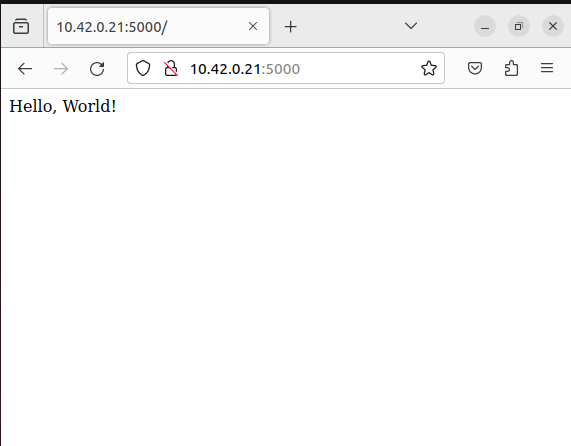

# Лабораторная работа №2 "Работа с Kubernetes"

## Выполнили:

Буй Ань Туан К34211, Нгуен Тиен Лонг К34201

## Цель работы:

Поднять kubernetes кластер локально, в нём развернуть свой сервис.

## Задачи:

Использовать 2-3 ресурса kubernetes, поднять кластер RKE.

## Ход работы:

Для поднятия локального Kubernetes кластера и развертывания своего сервиса были использованы RKE (K8S) и kubectl.

Для работы нам потребуются:

- Docker Engine – для создания образа Docker и контейнеров
- kuberctl – для запуска команд для кластеров Kubernetes
- RKE - для запуска Kubernetes на локальной машине

Для успешной работы необходимо, чтобы в системе были установлены docker, kubectl и RKE.

### Создание образа

Напишем статический сайт, который будем разворачивать. Внутри директории проекта создадим следующий Dockerfile:

```
FROM python:3.9

WORKDIR /code

COPY ./requirements.txt /code/requirements.txt

RUN pip install --no-cache-dir --upgrade -r /code/requirements.txt

COPY ./4docker /code/app

ENV PORT=5000

EXPOSE $PORT

CMD [ "python", "./app/app.py" ]

```

И requirements.txt

```
Jinja2==3.1.2
MarkupSafe==2.1.3
Werkzeug==3.0.1
blinker==1.7.0
click==8.1.7
colorama==0.4.6
flask==3.0.0
itsdangerous==2.1.2
```

### Работа с RKE

Код в файле deploy-helo.yaml представляет конфигурацию Kubernetes Deployment, который определяет, как развертывать и управлять подами.

Создадим файл deploy-helo.yaml:

```
apiVersion: apps/v1

kind: Deployment

metadata:

  name: deploy-helo

  labels:

    app: deploy-helo

spec:

  replicas: 2

  selector:

    matchLabels:

      app: deploy-helo

  template:

    metadata:

      labels:

        app: deploy-helo

    spec:

      containers:

        - name: deploy-helo

          image: tukafun/simple-kubernetes:latest

          ports:

            - containerPort: 5000
```

В поле kind указан ресурс Deployment, который управляет состоянием развертывания подов, описанное в манифесте, а также следит за удалением и созданием их экземпляров.

Помимо этого, в манифесте в поле replicas мы указали число 2, это означает, что в нашем кластере должно быть создано 2 экземпляра объекта.

<p align="center"></p>

Создадим service-helo.yaml:

```
apiVersion: v1

kind: Service

metadata:

  name: service-helo

spec:

  ports:

    - protocol: TCP

      targetPort: 5000

      port: 5000

  selector:

    app: deploy-helo
```

Применим:

> kubectl apply -f service.yaml
> kubectl apply -f service-helo.yaml

### Проверка работоспособности

Запустим сервис и и будем надеяться, что все сработает.

> kubectl get pods -o wide

<p align="center"></p>

> kubectl get service deploy-helo

<p align="center"></p>

Откроем браузер. Ура, все работает!

<p align="center"></p>

Успех!
А чтобы и вы смогли получить данный результат, вам необходимо запустить minikube, скачать данный репозиторий и выполнить следующие команды:

```
kubectl create -f deploy-helo.yaml
kubectl create -f service-helo.yaml
kubectl service deploy-helo
```
