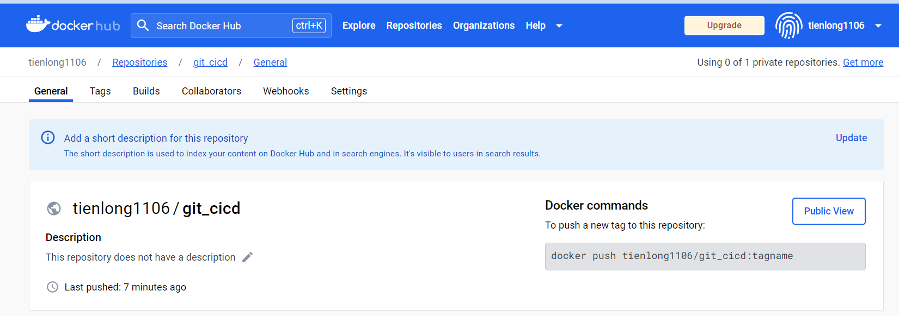
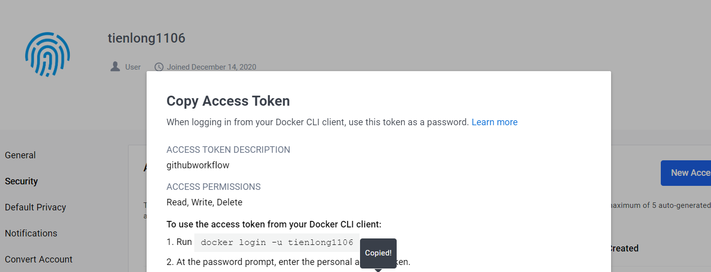
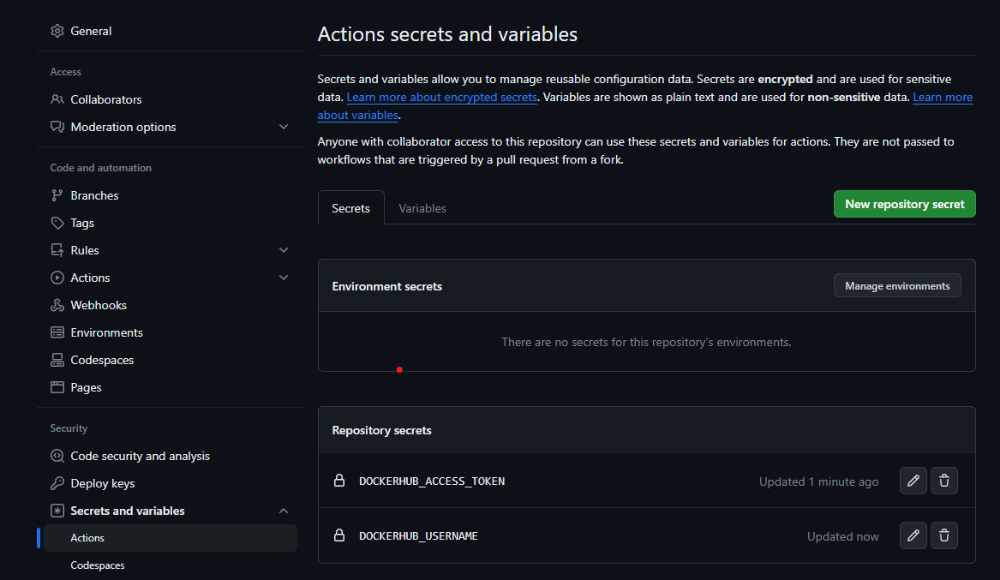
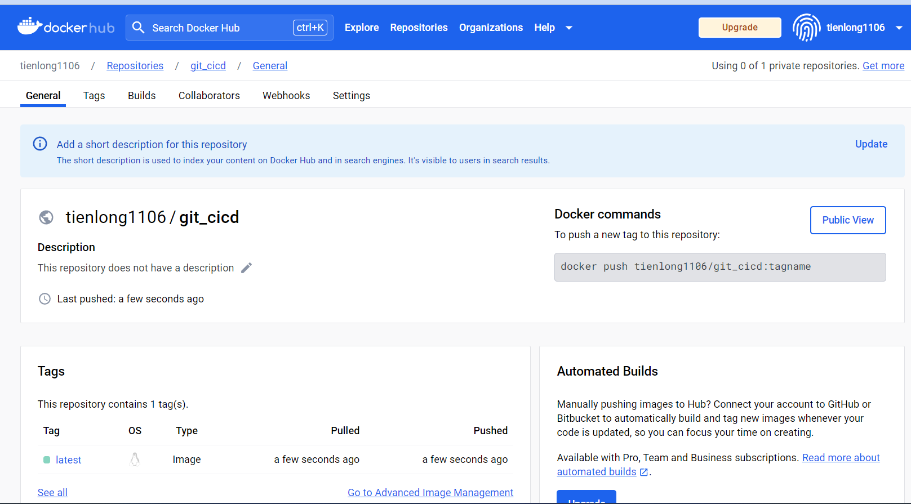
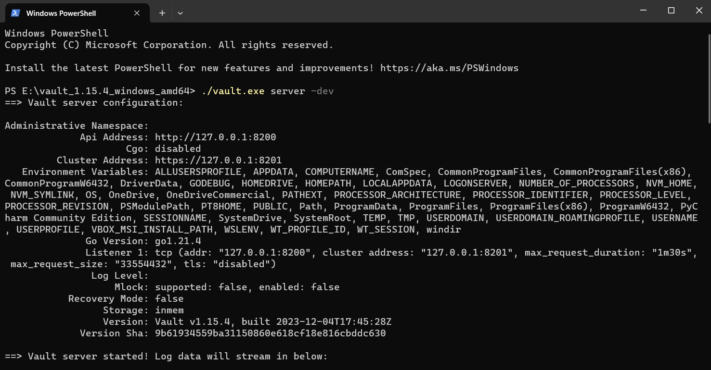
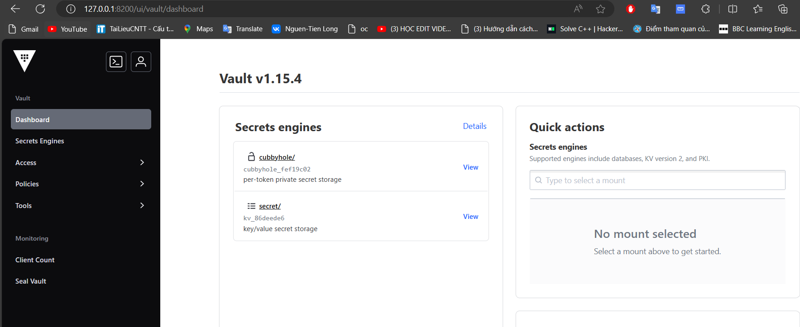
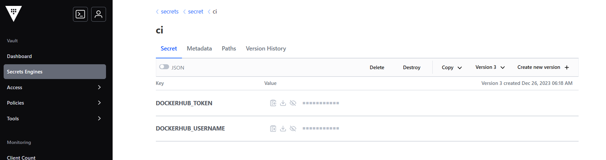
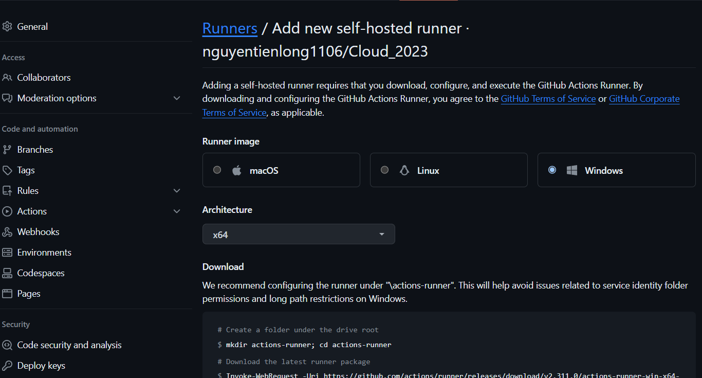
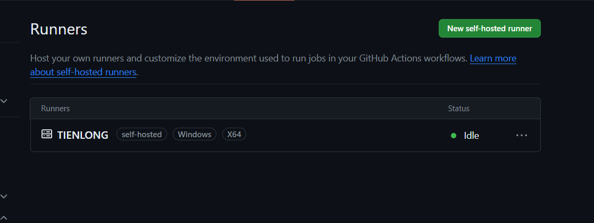

# Лабораторная работа №3
## Настройки CI/CD с помощью GitHub Actions
Для настройки GitHub Actions необходимо создать .yml файл в директории .github/workflows/.

```file.yml
name: Build and Push Docker image to Docker Hub

on:
  push:
    branches: ["main"]
jobs:
  push_to_registry:
    name: Push Docker image to Docker Hub
    runs-on: ubuntu-latest
    defaults:
      run:
        working-directory: "/Lap3/git_cicd"
    steps:
      - name: Check out the repo
        uses: actions/checkout@v4

      - name: Login to Docker Hub
        uses: docker/login-action@v3
        with:
          username: ${{ secrets.DOCKERHUB_USERNAME }}
          password: ${{ secrets.DOCKERHUB_ACCESS_TOKEN }}

      - name: Build and push Docker image
        uses: docker/build-push-action@v5
        with:
          context: ./Lap3/git_cicd/
          push: true
          tags: tienlong1106/git_cicd:latest
```
## Cпецифический
```yaml
name: Build and Push Docker image to Docker Hub
```

Это задает имя рабочего процесса GitHub Actions. В данном случае это «Создать и отправить образ Docker в Docker Hub».

```yaml
on:
  push:
    branches: ["main"]
```

Это определяет триггер для рабочего процесса. В этом случае рабочий процесс будет запускаться при каждом нажатии на «основную» ветку.

```yaml
jobs:
  push_to_registry:
    name: Push Docker image to Docker Hub
    runs-on: ubuntu-latest
    defaults:
      run:
        working-directory: "/Lap3/git_cicd"
```

Определяет задание с именем «push_to_registry». Это задание будет выполняться в среде Ubuntu («ubuntu-latest»). Он также устанавливает рабочий каталог по умолчанию для задания.
```yaml
    steps:
      - name: Check out the repo
        uses: actions/checkout@v4
```

На этом этапе проверяется содержимое репозитория. В версии v4 используется действие `actions/checkout`.

```yaml
      - name: Login to Docker Hub
        uses: docker/login-action@v3
        with:
          username: ${{ secrets.DOCKERHUB_USERNAME }}
          password: ${{ secrets.DOCKERHUB_ACCESS_TOKEN }}
```

На этом шаге используется `docker/login-action` для входа в Docker Hub. Он использует имя пользователя Docker Hub и токен доступа, хранящиеся как секреты в репозитории GitHub.

```yaml
      - name: Build and push Docker image
        uses: docker/build-push-action@v5
        with:
          context: ./Lap3/git_cicd/
          push: true
          tags: tienlong1106/git_cicd:latest
```

На этом этапе используется docker/build-push-action для создания и отправки образа Docker. Он определяет контекст сборки (`./Lap3/git_cicd/`), включает отправку (`push: true`) и устанавливает тег образа Docker (`tags: Tienlong1106/git_cicd:latest`).

Таким образом, этот рабочий процесс GitHub Actions запускается при отправке в «основную» ветку. Он проверяет репозиторий, входит в Docker Hub, а затем создает и отправляет образ Docker из указанного контекста с указанным тегом.
## Создать репозиторий в dockerhub

## Создать токен доступа к ключу

## Добавить ключ и имя пользователя в github

## Результат


----------------------------------------------------------------------------

## Secure GitOps Workflows with GitHub Actions and HashiCorp Vault

### First we have to download and execute run  Vault server in localhost 

- We dowload Vault from offical cite Hashicorp[https://developer.hashicorp.com/vault/install?product_intent=vault], we use package ARM64 for our windown

- Run it in terminal


- Check it on localhost


### The next we create security key 
Sets the VAULT_ADDR environment variable to the specified address:
```
$env:VAULT_ADDR="http://127.0.0.1:8200"
```

We can make keys by comand:
```
./vault.exe kv put secret/ci DOCKERHUB_USERNAME=long DOCKERHUB_TOKEN=Long1106
```

or we can create keys in the user interface


### Add new self-hosted runner

We have to go to github -> Setting -> Action -> Runner



Next is the easy task of running the command lines included in the instructions to result



### Final edit docker-compose.yml
- change "run on: seft-hosted" is meaned runners are machines that you set up and manage yourself
- add job

      - name: import-secrets
        uses: hashicorp/vault-action@v2
        with:
          url: http://127.0.0.1:8200
          tlsSkipVerify: true
          token: ${{ secrets.VAULT_TOKEN }}
          secrets: |
            secret/data//docker * | DOCKERHUB_

This code

name: This is the name of the step in your GitHub Actions workflow. In this case, it's named "import-secrets."

uses: Specifies the action that will be used for this step. In this case, it's using the hashicorp/vault-action version 2.

with: Provides input parameters for the action.

url: Specifies the URL of the HashiCorp Vault instance. In this example, it's set to http://127.0.0.1:8200.

tlsSkipVerify: A boolean indicating whether to skip TLS certificate verification. In this example, it's set to true, which means it will skip verification.

token: Specifies the HashiCorp Vault token. The token is retrieved from GitHub Secrets using ${{ secrets.VAULT_TOKEN }}.

secrets: Specifies the secrets to be imported. It looks like it's using the Vault CLI syntax. It's retrieving secrets from the path secret/data//docker* and renaming them with the prefix DOCKERHUB_. The * might be a wildcard character, and it's used to capture all secrets under the specified path.
