# Лабораторная работа №4 и звёздочкий

## Выполнили:

Буй Ань Туан К34211, Нгуен Тиен Лонг К34201

## Цель работы:

Контролируйте сервис, созданный в кубере, с помощью Prometheus и Grafana. Отображение как минимум двух активных графиков будет отражать состояние системы.

со звёздочкой:

Настройка кодов оповещений с помощью Prometheus показывает, как это работает. Постарайтесь убедиться, что оно отправлено через Telegram.

## Ход работы:

Сначала мы воспользуемся Helm, чтобы добавить репозиторий prometheus-community, затем установим репозиторий prometheus в kubernestes.

```
helm repo add prometheus-community https://prometheus-community.github.io/helm-charts

helm install prometheus prometheus-community/prometheus
```

<p align="center">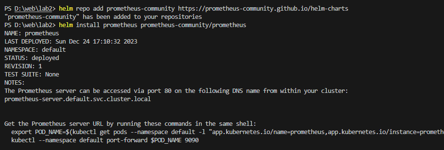</p>

Затем приступаем к запуску «prometheus»

```
kubectl expose service prometheus-server --type=NodePort --target-port=9090 --name=prometheus-server-up

minikube service prometheus-server-up
```

<p align="center">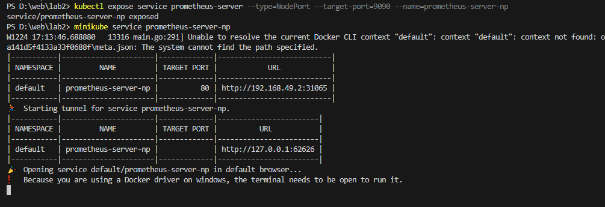</p>

Интерфейс Prometheus после успешного запуска:

<p align="center">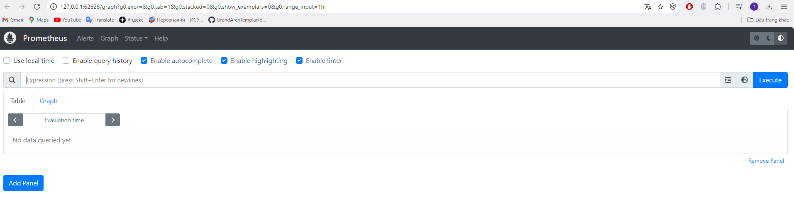</p>

Как и в случае с Prometheus, мы также добавляем репозиторий Grafana, а затем устанавливаем репозиторий Grafana в Kubernestes.

```
helm repo add grafana https://grafana.github.io/helm-charts

helm install grafana grafana/grafana
```

<p align="center">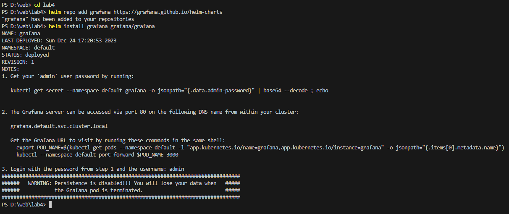</p>

Продолжаем получать пароль для входа пользователя: admin в Grafana.

```
kubectl get secret --namespace default grafana -o jsonpath="{.data.admin-password}" > a.json
```

Мы экспортируем пароль в файл a.json, а затем используем этот инструмент для декодирования base64.

<p align="center">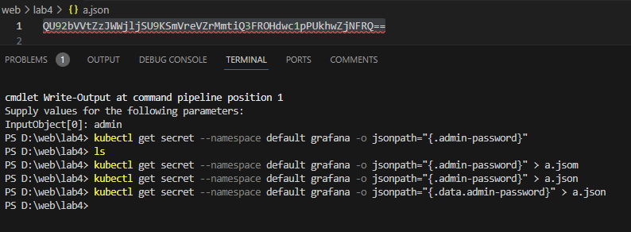</p>

Затем мы вошли в Grafana с указанным выше пользователем и паролем, и это интерфейс после успешного входа:

<p align="center">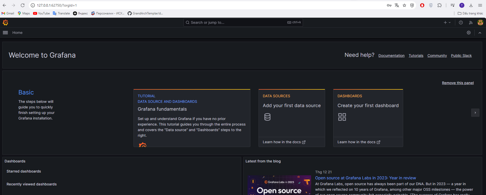</p>

Переходим к подключению Grafana к Prometheus: перейдя в «connection», затем выбрав «data source», чтобы добавить данные из Prometheus.

<p align="center">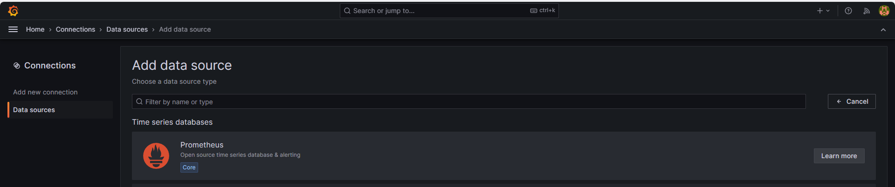</p>

Затем создаем новый Dashboard и выбираем «import», здесь выбираем тип отображения node-exporter-full (по id) на странице, которую рекомендует Grafana (https://grafana.com/grafana/dashboards/). Результат мы получаем такой, как на картинке, все отображается визуально. Если мы не хотим использовать этот тип отображения, мы можем использовать дисплей по умолчанию или найти другой подходящий тип отображения на странице «https://grafana.com/grafana/dashboards/».

<p align="center">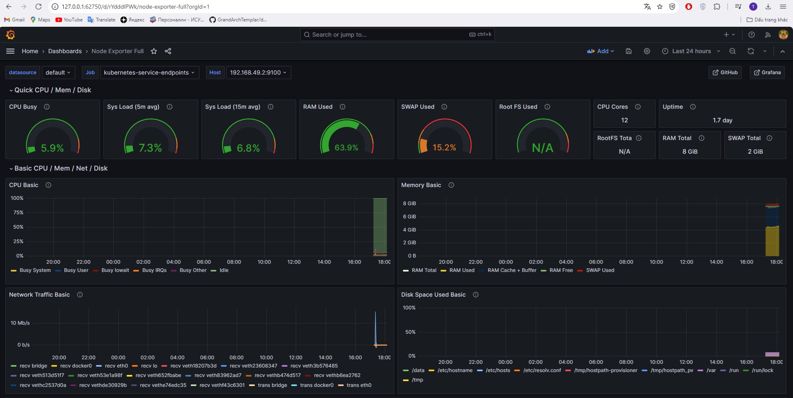</p>

### Со звёздочкой:

Мы перечисляем модули, которые в настоящее время находятся в нашей системе, поскольку изначально, когда мы устанавливаем repo Prometheus, он будет включать в себя alertmanager. Это удобно, поскольку на этом этапе нам не нужно устанавливать дополнительный alertmanager.

```
kubectl get pods
```

<p align="center">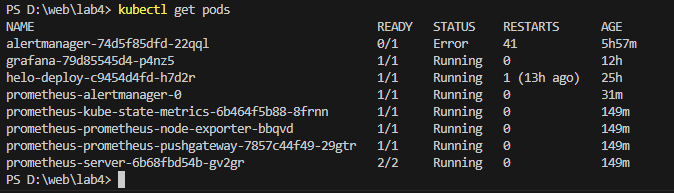</p>

Перейдите к запуску Pod service prometheus-alertmanager.

```
kubectl port-forward prometheus-alertmanager-0 9999:9093
```

<p align="center">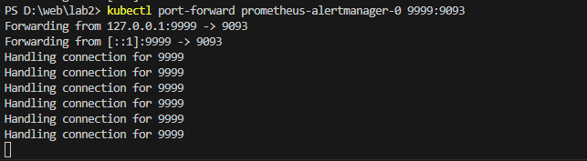</p>

Затем мы приступаем к созданию простого правила на Prometheus для тестирования. Добавляем содержимое правил в файл configmap с помощью команды:

```
kubectl edit configmap
```

И prometheus автоматически загрузит это rule в file config.

Rule: цель Rule — предупреждать систему каждый раз, когда 1 node выходит из строя (prometheus не может собирать метрики с клиентских узлов) через 10 секунд.

```
        - alert: InstanceDown
          expr: up == 0
          for: 10s
          labels:
            severity: page
          # Prometheus templates apply here in the annotation and label fields of the alert.
          annotations:
            description: '{{ $labels.instance }} of job {{ $labels.job }} has been down for more than 10 s.'
            summary: 'Instance {{ $labels.instance }} down'

```

Результат rule успешно загружен.

<p align="center">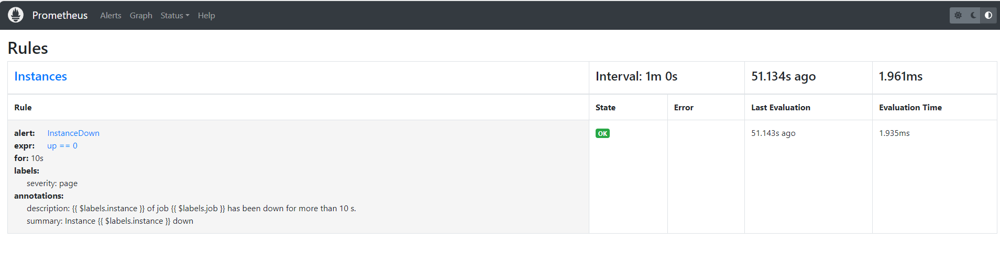</p>

Проверив alert на prometheus, мы получаем оповещение, как показано на изображении, соответствующее критериям, которые мы заявили в rule.

<p align="center">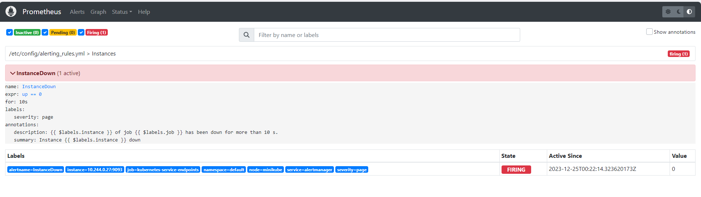</p>

Далее мы приступаем к изменению config alertmanager, чтобы он отправлял оповещения на наш канал, добавляя контент в раздел «alertmanager.yml:», этот контент связан с файлом «/etc/alertmanager/alertmanager.yml» в pod «prometheus-alertmanager». И alertmanager загрузит содержимое файла «/etc/alertmanager/alertmanager.yml», в результате чего содержимое config alertmanager будет успешно отредактировано для передачи оповещения в наш канал Telegram (как показано на изображении ниже).

Содержимое файла Alertmanager.yml: оповещения будут отправляться каждые 5 минут.

```
global: {}
      receivers:
      - name: default-receiver
        telegram_configs:
            api_url: 'https://api.telegram.org'
            bot_token: 6881019421:........Pqbs0MXVcaZFHTQ
            chat_id: -1002....37417
            parse_mode: 'Markdown'
      route:
        group_interval: 5m
        group_wait: 10s
        receiver: default-receiver
        repeat_interval: 5m
      templates:
      - /etc/alertmanager/*.tmpl

```

<p align="center">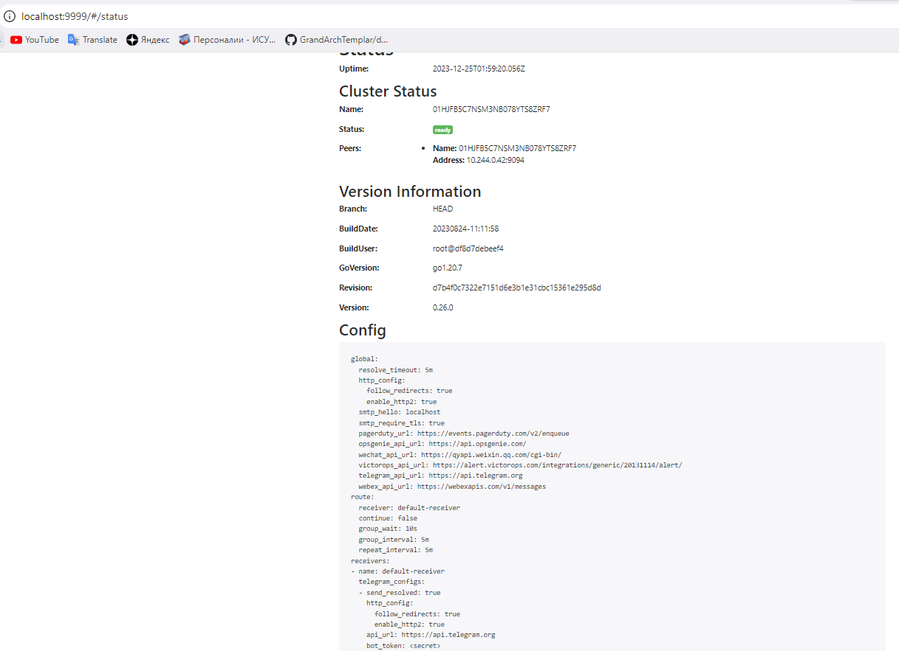</p>

Сразу после успешного изменения конфига alertmanager наш телеграм-канал каждые 5 минут получал предупреждающие сообщения об ошибках InstanceDown (аналогично предупреждениям на прометее). Полученное предупреждение включает в себя много информации о проблемном экземпляре в нашей системе, например IP-адрес, пространство имен, описание и т. д. (можно увидеть на изображении ниже).

<p align="center">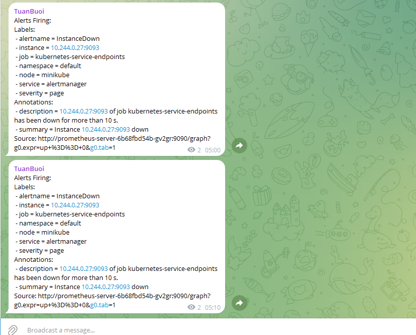</p>
