# Звёздочкая Лабораторная работа №2

## Выполнили:

Буй Ань Туан К34211, Нгуен Тиен Лонг К34201

## Цель работы:

Настроить подключение к вашему сервису в миникубе через https. Используйте самоподписанный сертификат. Для подтверждения приложите скриншот с информацией о сертификате из браузера.

## Ход работы:

Сначала устанавливаем Ingress (Ingress — это ресурс, используемый для управления и координации потока сетевого трафика к сервисам в кластере Kubernetes. Ingress позволяет настраивать правила маршрутизации на основе запросов HTTP/HTTPS, таких как имена доменов, префиксы URL-адресов, методы HTTP и многое другое):

<p align="center">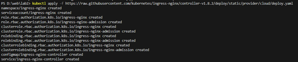</p>

После установки Ingress проверьте результаты командой:

```
kubectl get pods --namespace=ingress-nginx
```

<p align="center">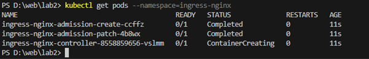</p>

Используйте инструмент шифрования openssl, чтобы создать самозаверяющий сертификат, используя команду:

```
openssl req -x509 -sha256 -newkey rsa:4096 -keyout tls.key -out tls.crt -days 365 -nodes
```

Добавьте необходимую информацию, такую ​​как: Country Name, State or Province Name, Locality Name, ... , в интерфейс после выполнения команды, результат будет таким, как показано ниже:

<p align="center">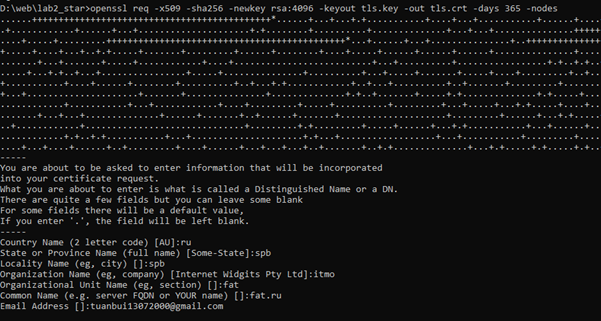</p>

В результате получается 2 файла: tls.key и tls.crt (изображение ниже):

<p align="center">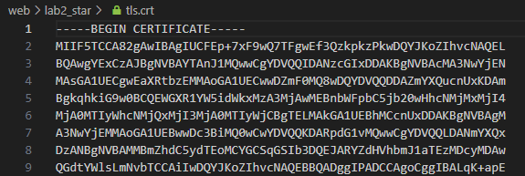</p>

<p align="center">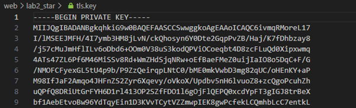</p>

Затем продолжайте создавать секрет сертификата с помощью команды:

```
kubectl create secret tls myapp-tls-secret --cert=tls.key
```

<p align="center">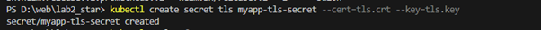</p>

Проверьте результат:

<p align="center">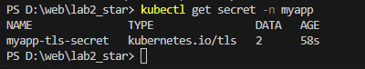</p>

Затем создайте файл myapp.yaml с содержимым:

```
apiVersion: apps/v1
kind: Deployment
metadata:
  name: my

spec:
  replicas: 1
  selector:
    matchLabels:
      app: my-app
  template:
    metadata:
      labels:
        app: my-app
    spec:
      containers:
        - name: my-app
          image: tukafun/simple-kubernetes:latest
          ports:
            - containerPort: 80

---
apiVersion: v1
kind: Service
metadata:
  name: my-src

spec:
  selector:
    app: my-app
  ports:
    - protocol: TCP
      port: 80
      targetPort: 80

---
apiVersion: networking.k8s.io/v1
kind: Ingress

metadata:
  name: my-ing

spec:
  ingressClassName: nginx
  tls:
    - hosts:
        - fat.ru
      secretName: myapp-tls-secret
  defaultBackend:
    service:
      name: my-src
      port:
        number: 80
  rules:
    - host: "fat.ru"
      http:
        paths:
          - path: "/"
            pathType: Prefix
            backend:
              service:
                name: my-app
                port:
                  number: 80
```

Запустите команду «kubectl apply -f». чтобы начать обслуживание. Полученные результаты:

<p align="center">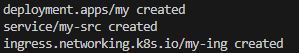</p>

Тогда посетите адрес «https://fat.ru/» для проверки сервиса:

<p align="center">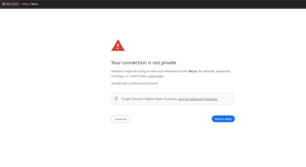</p>

Нажмите «Not secure» и проверьте сертификат:

<p align="center">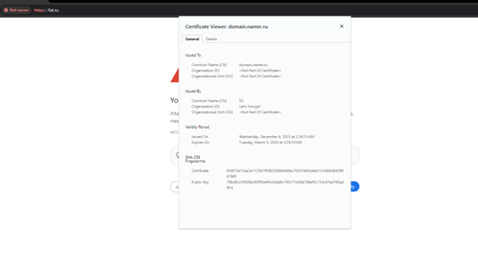</p>

Большинство самозаверяющих сертификатов недействительны для браузеров, поскольку они не аутентифицированы надежным посредником. Кроме того, если вы хотите использовать самозаверяющий сертификат без предупреждения браузера, вам необходимо указать доменное имя (купить домен).

Если вы продолжите доступ, результаты будут следующими:

<p align="center">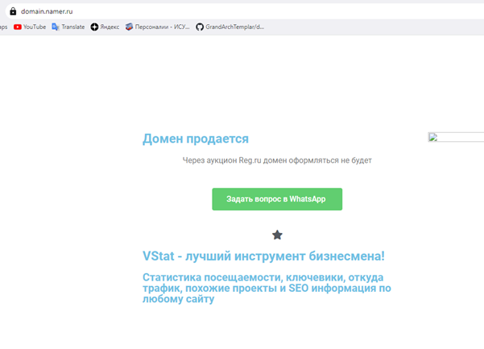</p>

Поскольку доменное имя, объявленное в myapp.yaml, еще не принадлежит, результат будет таким, как показано на рисунке.
